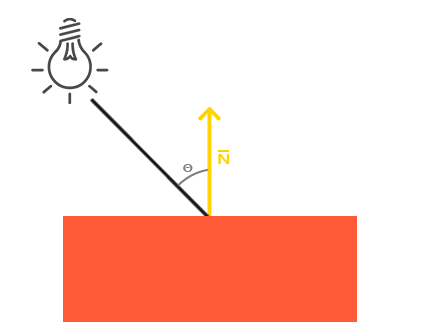
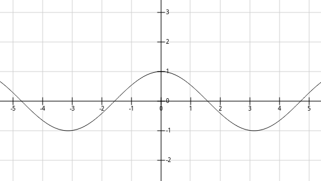
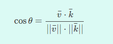
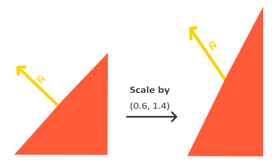

#### 光照

光的成分：RGBA决定

1、环境光（ambient）：没有方向，全局影响。

2、散射光（diffuse）：由方向，蜡烛，台灯等。

3、镜面光（specular） ：很强的方向性，取决于观察方向，太阳，聚光灯。

#### 模拟光照

模拟漫反射光和环境光，每一种光源多多少少都含有各种类型的光。

如果物体的颜色是固定的，我们想要改变物体的颜色，可以把颜色值乘以一个变量，以达到改变颜色的效果。光照也是使用这个原理实现的，如下面的公式：最终颜色=物体颜色*环境光因子。
```
final color = material color * ambient light color
```

例如一个光源的亮度是固定的，我们把光源的亮度乘以0.1当作环境光因子，然后用这个因子来计算物体的颜色。

```
	float ambientStrength = 0.1f;
    vec3 ambient = ambientStrength * lightColor;
    vec3 result = ambient * objectColor;
    color = vec4(result, 1.0f);
```

但是现实中这个因子不是固定的，所以为了尽可能地接近现实的光照效果，这个因子需要通过计算得出：

首先看看下面的这个图，光照和平面的垂线形成了一个角度Θ，当角度为0度时，即光照方向垂直平面，这个时候平面的亮度最大；当角度为90度时，光照方向和平面平行了，此时平面没有接收光照，亮度最暗。刚好可以使用cos函数来模拟计算这个变化。



cos(x)函数：



所以可以使用cos(Θ)来做光照强度的一个计算变量,但是这个数值是大于0的,这个数值称为lambert factor：

```
lambert factor = max(cos(Θ), 0)
```

而cos(Θ)的计算方式可以通过平面的法向量以及光照的方向向量计算得出:



然而实际光照还受到距离的影响，所以最后还需要乘一个和距离成正比的衰减因子：
衰减因子按照剧情情况而定，这里给出一种情况：

```
luminosity = 1 / (distance * distance)
```

所以最终的颜色是这样的：

```
final color = material color * (light color * lambert factor * luminosity)
```


#### 计算光照

通过上面的推导，需要使用到顶点坐标，顶点颜色，顶点法向量。为了方便计算和提高代码可读性，我们存储三个数组：

```
    // X, Y, Z
    final float[] cubePositionData
    // R, G, B, A
    final float[] cubeColorData
    //法线方向X，Y，Z
    final float[] cubeNormalData;
    
    //以下是光源
    //local space的坐标，使用4维，平移的时候使用矩阵乘法
    private final float[] mLightPosInModelSpace = new float[]{0.0f, 0.0f, 0.0f, 1.0f};

    //使用model matrix转化后的世界坐标
    private final float[] mLightPosInWorldSpace = new float[4];

    //使用view matrix转化后的视图坐标
    private final float[] mLightPosInEyeSpace = new float[4];
```

光照的计算都在 vertex shader 里面

```
final String vertexShader =
                "uniform mat4 u_MVPMatrix;      \n"        // mvp矩阵，存储最终的位置信息
                        + "uniform mat4 u_MVMatrix;       \n"        // mv矩阵用于计算光源到当前顶点的位置
                        + "uniform vec3 u_LightPos;       \n"        // 视图空间的光源位置

                        + "attribute vec4 a_Position;     \n"        // 顶点位置信息
                        + "attribute vec4 a_Color;        \n"        // 顶点颜色信息
                        + "attribute vec3 a_Normal;       \n"        // 顶点法线

                        + "varying vec4 v_Color;          \n"        // 用于传递到片段着色器的颜色

                        + "void main()                    \n"    // The entry point for our vertex shader.
                        + "{                              \n"
                        // 顶点坐标传换成视图坐标
                        + "   vec3 modelViewVertex = vec3(u_MVMatrix * a_Position);              \n"
                        // 转换法线方向到视图坐标
                        + "   vec3 modelViewNormal = vec3(u_MVMatrix * vec4(a_Normal, 0.0));     \n"
                        // 光源到顶点的距离
                        + "   float distance = length(u_LightPos - modelViewVertex);             \n"
                        // 光源到当前顶点的方向向量（规范化）
                        + "   vec3 lightVector = normalize(u_LightPos - modelViewVertex);        \n"
                        // 计算顶点法向量和光源向量的点乘，如果光源向量和法向量相同，则获得最大亮度
                        + "   float diffuse = max(dot(modelViewNormal, lightVector), 0.1);       \n"
                        // 根据距离计算衰减因子
                        + "   diffuse = diffuse * (1.0 / (1.0 + (0.25 * distance * distance)));  \n"
                        // 根据衰减因子计算光照强度，使用在片段着色器上
                        + "   v_Color = a_Color * diffuse;                                       \n"
                        // 计算最终的位置
                        + "   gl_Position = u_MVPMatrix * a_Position;                            \n"
                        + "}                                                                     \n";

```

上面计算法线方向:

```
vec3 modelViewNormal = vec3(u_MVMatrix * vec4(a_Normal, 0.0));
```
无论何时当我们提交一个不等比缩放(注意：等比缩放不会破坏法线，因为法线的方向没被改变，而法线的长度很容易通过标准化进行修复)，法向量就不会再垂直于它们的表面了，这样光照会被扭曲。




修复这个行为的诀窍是使用另一个为法向量专门定制的模型矩阵。这个矩阵称之为正规矩阵(Normal Matrix)，它是进行了一点线性代数操作移除了对法向量的错误缩放效果。

在顶点着色器中，我们可以使用inverse和transpose函数自己生成正规矩阵，inverse和transpose函数对所有类型矩阵都有效。注意，我们也要把这个被处理过的矩阵强制转换为3×3矩阵，这是为了保证它失去了平移属性，之后它才能乘以法向量。

对于着色器来说，逆矩阵也是一种开销比较大的操作，因此，无论何时，在着色器中只要可能就应该尽量避免逆操作，因为它们必须为你场景中的每个顶点进行这样的处理。以学习的目的这样做很好，但是对于一个对于效率有要求的应用来说，在绘制之前，你最好用CPU计算出正规矩阵，然后通过uniform把值传递给着色器(和模型矩阵一样)。

### 面剔除

使用的API：

```
        GLES20.glEnable(GLES20.GL_CULL_FACE);
```

当我们定义一系列的三角顶点时，我们会把它们定义为一个特定的连接顺序(Winding Order)，它们可能是顺时针的或逆时针的。每个三角形由3个顶点组成，我们从三角形的中间去看，从而把这三个顶点指定一个连接顺序。

每三个顶点都形成了一个包含着连接顺序的基本三角形。OpenGL使用这个信息在渲染你的基本图形的时候决定这个三角形是三角形的正面还是三角形的背面。默认情况下，逆时针的顶点连接顺序被定义为三角形的正面。

当定义你的顶点顺序时，你如果定义能够看到的一个三角形，那它一定是正面朝向的，所以你定义的三角形应该是逆时针的，就像你直接面向这个三角形。把所有的顶点指定成这样是件炫酷的事，实际的顶点连接顺序是在光栅化阶段（Rasterization stage）计算的，所以当顶点着色器已经运行后。顶点就能够在观察者的观察点被看到。

我们指定了它们以后，观察者面对的所有的三角形的顶点的连接顺序都是正确的，但是现在渲染的立方体另一面的三角形的顶点的连接顺序被反转。最终，我们所面对的三角形被视为正面朝向的三角形，后部的三角形被视为背面朝向的三角形。下图展示了这个效果：


在顶点数据中，我们定义的是两个逆时针顺序的三角形。然而，从观察者的方面看，后面的三角形是顺时针的，如果我们仍以1、2、3的顺序以观察者当面的视野看的话。即使我们以逆时针顺序定义后面的三角形，它现在还是变为顺时针。它正是我们打算剔除（丢弃）的不可见的面！

OpenGL允许我们改变剔除面的类型。要是我们剔除正面而不是背面会怎样？我们可以调用glCullFace来做这件事：

```
glCullFace(GL_BACK);
```

glCullFace函数有三个可用的选项：

```
GL_BACK：只剔除背面。
GL_FRONT：只剔除正面。
GL_FRONT_AND_BACK：剔除背面和正面。
```

glCullFace的初始值是GL_BACK。另外，我们还可以告诉OpenGL使用顺时针而不是逆时针来表示正面，这通过glFrontFace来设置：

```
glFrontFace(GL_CCW);
```
默认值是GL_CCW，它代表逆时针，GL_CW代表顺时针顺序。

### 深度测试

使用的API:

```
        GLES20.glEnable(GLES20.GL_DEPTH_TEST);
```

当我们绘制图形的时候，正常情况下前面的图形会挡住后面的图形，但是OpenGL里面不会自动处理，需要打开这个开关才能实现被挡住的面不绘制到前面。

### 使用多个Shader

当有多个shader program的时候，切换不同shader都要使用GLES20.glUseProgram 来切换，然后再执行绘制命令。

