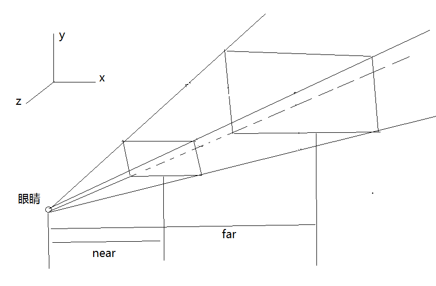

### OpenGL ES
OpenGL ES (OpenGL for Embedded Systems) 是 OpenGL三维图形 API 的子集，针对手机、PDA和游戏主机等嵌入式设备而设计。该API由Khronos集团定义推广，Khronos是一个图形软硬件行业协会，该协会主要关注图形和多媒体方面的开放标准。
OpenGL ES 是从 OpenGL 裁剪的定制而来的，去除了glBegin/glEnd，四边形（GL_QUADS）、多边形（GL_POLYGONS）等复杂图元等许多非绝对必要的特性。经过多年发展，现在主要有两个版本，OpenGL ES 1.x 针对固定管线硬件的，OpenGL ES 2.x 针对可编程管线硬件。OpenGL ES 1.0 是以 OpenGL 1.3 规范为基础的，OpenGL ES 1.1 是以 OpenGL 1.5 规范为基础的，它们分别又支持 common 和 common lite两种profile。lite profile只支持定点实数，而common profile既支持定点数又支持浮点数。 OpenGL ES 2.0 则是参照 OpenGL 2.0 规范定义的，common profile发布于2005-8，引入了对可编程管线的支持。最新的OpenGL ES 3.X是兼容2.0版本的。

OpenGL ES 3.0主要新功能有：

1、渲染管线多重增强，实现先进视觉效果的加速，包括遮挡查询(Occlusion Query)、变缓反馈(Transform Feedback)、实例渲染(Instanced Rendering)、四个或更多渲染目标支持。

2、高质量ETC2/EAC纹理压缩格式成为一项标准功能，不同平台上不再需要需要不同的纹理集。

3、新版GLSL ES 3.0着色语言，全面支持整数和32位浮点操作。

4、纹理功能大幅增强，支持浮点纹理、3D纹理、深度纹理、顶点纹理、NPOT纹理、R/RG单双通道纹理、不可变纹理、2D阵列纹理、无二次幂限制纹理、阴影对比、调配(swizzle)、LOD与mip level clamps、无缝立方体贴图、采样对象、纹理MSAA抗锯齿渲染器。

5、一系列广泛的精确尺寸纹理和渲染缓冲格式，便携移动应用更简单。

### 相关概念

#### 1、OpenGL世界坐标系：

在OpenGL中，世界坐标系是以屏幕中心为原点(0, 0, 0)，且是始终不变的。你面对
屏幕，你的右边是x正轴，上面是y正轴，屏幕指向你的为z正轴。长度单位这样来定：
窗口范围按此单位恰好是(-1,-1)到(1,1)，即屏幕左下角坐标为（-1，-1），右上角
坐标为（1,1）。

#### 2、3D世界相关设置


通过这个函数设置眼睛和观察的位置，以及眼睛向上的方向。

```java
Matrix.setLookAtM(mViewMatrix, 0, eyeX, eyeY, eyeZ, lookX, lookY, lookZ, upX, upY, upZ);

```
通过上面设置了眼睛和观察位置之后，就需要根据上面的值设置frustum的相关值。

mProjectionMatrix:用于保存投影矩阵。
0：offset。
left：左边的距离（比例）。
right：右边的距离（比例）。
bottom：下边的距离（比例）。
top：上边的距离（比例）。
near:和近截面的距离， 眼睛距离>=near>=0。
far：和远截面的距离，far>near。

```java
Matrix.frustumM(mProjectionMatrix, 0, left, right, bottom, top, near, far);
```

对应的图如下：




### OpenGL Shader Language （GLSL）语言
OpenGL着色语言（OpenGL Shading Language）是用来在OpenGL中着色编程的语言，也即开发人员写的短小的自定义程序，他们是在图形卡的GPU （Graphic Processor Unit图形处理单元）上执行的，代替了固定的渲染管线的一部分，使渲染管线中不同层次具有可编程型。比如：视图转换、投影转换等。GLSL（GL Shading Language）的着色器代码分成2个部分：Vertex Shader（顶点着色器）和Fragment（片断着色器），有时还会有Geometry Shader（几何着色器）。负责运行顶点着色的是顶点着色器。它可以得到当前OpenGL 中的状态，GLSL内置变量进行传递。GLSL其使用C语言作为基础高阶着色语言，避免了使用汇编语言或硬件规格语言的复杂性。

### 着色器 shader
OpenGL 2.0 上我们想要绘制任何东西都需要一个vertexShader和fragment Shader。


