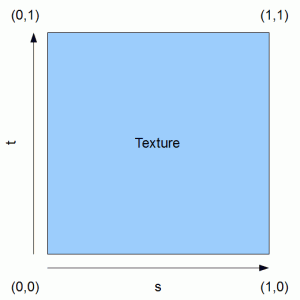

### 纹理坐标系

OpenGL 里面纹理的坐标使用(s,t)代替(x,y)。



纹理坐标在x和y轴上，范围为0到1之间（注意我们使用的是2D纹理图像）。使用纹理坐标获取纹理颜色叫做采样(Sampling)。纹理坐标起始于(0, 0)，也就是纹理图片的左下角，终始于(1, 1)，即纹理图片的右上角。

### 使用纹理渲染

我们需要添加一个数组来存储纹理的坐标。

```
    final float[] cubeTextureCoordinateData;

	mCubeTextureCoordinates = ByteBuffer.allocateDirect(cubeTextureCoordinateData.length * mBytesPerFloat)
	.order(ByteOrder.nativeOrder()).asFloatBuffer();
	mCubeTextureCoordinates.put(cubeTextureCoordinateData).position(0);
```

顶点着色器修改

```
attribute vec2 a_TexCoordinate; // 需要传进去的纹理坐标
...
varying vec2 v_TexCoordinate;   // 传入片段着色器的纹理坐标
...
// 纹理坐标赋值
v_TexCoordinate = a_TexCoordinate;
```

片段着色器修改

```
uniform sampler2D u_Texture;    // The input texture.
...
varying vec2 v_TexCoordinate; // Interpolated texture coordinate per fragment.
...
// Add attenuation.
 diffuse = diffuse * (1.0 / (1.0 + (0.10 * distance)));
...
// Add ambient lighting
 diffuse = diffuse + 0.3;
...
// Multiply the color by the diffuse illumination level and texture value to get final output color.
gl_FragColor = (v_Color * diffuse * texture2D(u_Texture, v_TexCoordinate));
```

加载纹理

```
public static int loadTexture(final Context context, final int resourceId)
	{
		final int[] textureHandle = new int[1];
		GLES20.glGenTextures(1, textureHandle, 0);
		if (textureHandle[0] != 0)
		{
			final BitmapFactory.Options options = new BitmapFactory.Options();
			options.inScaled = false;	// No pre-scaling

			// Read in the resource
			final Bitmap bitmap = BitmapFactory.decodeResource(context.getResources(), resourceId, options);
			// 绑定对应的纹理到OpenGL
			GLES20.glBindTexture(GLES20.GL_TEXTURE_2D, textureHandle[0]);
			// 设置纹理过滤类型
			GLES20.glTexParameteri(GLES20.GL_TEXTURE_2D, GLES20.GL_TEXTURE_MIN_FILTER, GLES20.GL_NEAREST);
			GLES20.glTexParameteri(GLES20.GL_TEXTURE_2D, GLES20.GL_TEXTURE_MAG_FILTER, GLES20.GL_NEAREST);
			// 加载纹理
			GLUtils.texImage2D(GLES20.GL_TEXTURE_2D, 0, bitmap, 0);
			// Recycle the bitmap, since its data has been loaded into OpenGL.
			bitmap.recycle();
		}
		if (textureHandle[0] == 0)
		{
			throw new RuntimeException("Error loading texture.");
		}
		return textureHandle[0];
	}
```

纹理过滤

纹理坐标不依赖于分辨率(Resolution)，它可以是任意浮点值，所以OpenGL需要知道怎样将纹理像素(Texture Pixel，也叫Texel)映射到纹理坐标。当你有一个很大的物体但是纹理的分辨率很低的时候这就变得很重要了。OpenGL也有对于纹理过滤(Texture Filtering)的选项。纹理过滤有很多个选项，但是现在我们只讨论最重要的两种：GL_NEAREST和GL_LINEAR。

GL_NEAREST（也叫邻近过滤，Nearest Neighbor Filtering）是OpenGL默认的纹理过滤方式。当设置为GL_NEAREST的时候，OpenGL会选择中心点最接近纹理坐标的那个像素。下图中你可以看到四个像素，加号代表纹理坐标。左上角那个纹理像素的中心距离纹理坐标最近，所以它会被选择为样本颜色。

GL_LINEAR（也叫线性过滤，(Bi)linear Filtering）它会基于纹理坐标附近的纹理像素，计算出一个插值，近似出这些纹理像素之间的颜色。一个纹理像素的中心距离纹理坐标越近，那么这个纹理像素的颜色对最终的样本颜色的贡献越大。下图中你可以看到返回的颜色是邻近像素的混合色。

对应使用的效果如下：


多级渐远纹理

想象一下，假设我们有一个包含着上千物体的大房间，每个物体上都有纹理。有些物体会很远，但其纹理会拥有与近处物体同样高的分辨率。由于远处的物体可能只产生很少的片段，OpenGL从高分辨率纹理中为这些片段获取正确的颜色值就很困难，因为它需要对一个跨过纹理很大部分的片段只拾取一个纹理颜色。在小物体上这会产生不真实的感觉，更不用说对它们使用高分辨率纹理浪费内存的问题了。

OpenGL使用一种叫做多级渐远纹理(Mipmap)的概念来解决这个问题，它简单来说就是一系列的纹理图像，后一个纹理图像是前一个的二分之一。多级渐远纹理背后的理念很简单：距观察者的距离超过一定的阈值，OpenGL会使用不同的多级渐远纹理，即最适合物体的距离的那个。由于距离远，解析度不高也不会被用户注意到。同时，多级渐远纹理另一加分之处是它的性能非常好。让我们看一下多级渐远纹理是什么样子的：


手工为每个纹理图像创建一系列多级渐远纹理很麻烦，幸好OpenGL有一个glGenerateMipmaps函数，在创建完一个纹理后调用它OpenGL就会承担接下来的所有工作了。后面的教程中你会看到该如何使用它。

在渲染中切换多级渐远纹理级别(Level)时，OpenGL在两个不同级别的多级渐远纹理层之间会产生不真实的生硬边界。就像普通的纹理过滤一样，切换多级渐远纹理级别时你也可以在两个不同多级渐远纹理级别之间使用NEAREST和LINEAR过滤。为了指定不同多级渐远纹理级别之间的过滤方式，你可以使用下面四个选项中的一个代替原有的过滤方式：

|过滤方式|	描述
|--------|--------|
|GL_NEAREST_MIPMAP_NEAREST	|使用最邻近的多级渐远纹理来匹配像素大小，并使用邻近插值进行纹理采样
|GL_LINEAR_MIPMAP_NEAREST	|使用最邻近的多级渐远纹理级别，并使用线性插值进行采样
|GL_NEAREST_MIPMAP_LINEAR	|在两个最匹配像素大小的多级渐远纹理之间进行线性插值，使用邻近插值进行采样
|GL_LINEAR_MIPMAP_LINEAR	|在两个邻近的多级渐远纹理之间使用线性插值，并使用线性插值进行采样

就像纹理过滤一样，我们可以使用glTexParameteri将过滤方式设置为前面四种提到的方法之一：

```
glTexParameteri(GL_TEXTURE_2D, GL_TEXTURE_MIN_FILTER, GL_LINEAR_MIPMAP_LINEAR);
glTexParameteri(GL_TEXTURE_2D, GL_TEXTURE_MAG_FILTER, GL_LINEAR);
```

一个常见的错误是，将放大过滤的选项设置为多级渐远纹理过滤选项之一。这样没有任何效果，因为多级渐远纹理主要是使用在纹理被缩小的情况下的：纹理放大不会使用多级渐远纹理，为放大过滤设置多级渐远纹理的选项会产生一个GL_INVALID_ENUM错误代码。


